# **Algoritma dan Struktur Data 2021-2022** 

**Nama : Andhito Galih Nur Cahyo**

**Kelas : 1F**

**No absen : 06**

**Nim : 2141720138**

**JOBSHEET - 5** 

**SORTING (BUBBLE, SELECTION, DAN INSERTION SORT)** 

**5.2 Mengurutkan Data Mahasiswa Berdasarkan IPK Menggunakan Bubble Sort** 

**5.2.1 Langkah-langkah Percobaan** 

**5.2.2 Verifikasi Hasil Percobaan** 

Cocokan hasilnya dengan yang terdapat pada tampilan di bawah ini 

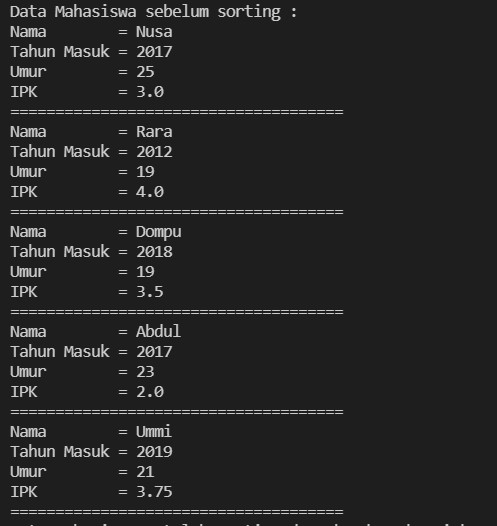

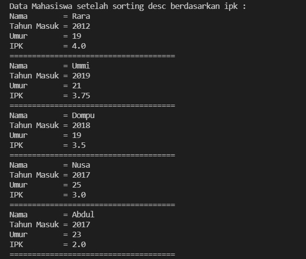

**5.2.3 Pertanyaan** 

1. Terdapat di method apakah proses bubble sort?
2. Terdapat di method apakah proses selection sort?
3. Apakah yang dimaksud proses swap? Tuliskan potongan program untuk melakukan 
proses swap tersebut!
4. Di dalam method bubbleSort(), terdapat baris program seperti di bawah ini:
Untuk apakah proses tersebut?
5. Perhatikan perulangan di dalam bubbleSort() di bawah ini:
a. Apakah perbedaan antara kegunaan perulangan i dan perulangan j? 
b. Mengapa syarat dari perulangan i adalah i<listMhs.length-1 ?
c. Mengapa syarat dari perulangan j adalah j<listMhs.length-i ?
d. Jika banyak data di dalam listMhs adalah 50, maka berapakali perulangan i akan 
berlangsung? Dan ada berapa Tahap bubble sort yang ditempuh

**Jawab:** 

1. Terdapat pada method **bubbleSort()** dan di class **DaftarMahasiswaBerprestasi**. Terdapat pada baris ke 21-31, dapat dilihat pada gambar di bawah ini:

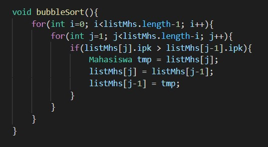

2. Berada di  method **selectionSort()** dan di class **DaftarMahasiswaBerprestasi** pada baris ke 33-46 , dapat di lihat pada gambar di bawah ini:

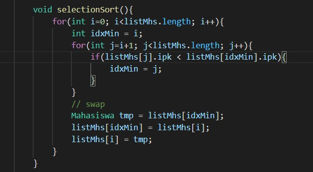

3. Proses swap adalah suatu proses penukaran/pengurutan suatu objek/nilai pada sorting. Potongan kodenya sebagai berikut:
- Praktikum 1 --> bubbleSort():
    


- Praktikum 2 --> selectionSort():


- Praktikum 3 --> insertionSort():

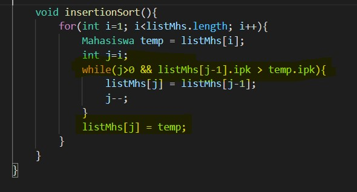


4. Baris program di atas merupakan proses swap. Pertama, dilakukan suatu perbandingan dimana jika nilai dari ``listMhs[j].ipk > listMhs[j-1].ipk`` memenuhi kriteria dan syarat, maka akan dilakukan proses swap yang tertera pada program di atas. lebih tepatnya pada baris program berikut:
```
Mahasiswa tmp = listMhs[j];
listMhs[j] = listMhs[j-1];
listMhs[j-1] = tmp;
```

5. a. Perbedaan yang ada dalam perulangan i dan j, yaitu pada perulangan i digunakan untuk melakukan perulangan sesuai dengan jumlah nilai yang ada untuk dilakukan perturkaran/perurutan, atau bisa dikatakan menjadi patokan berapa kali/tahap proses pertukaran dilakukan. Sedangkan, perulangan j digunakan untuk proses pertukaran sesuai dengan kriteria yang telah ditentukan

    b. Karena pada perulangan i tersebut dimulai dari angka 0 agar dapat mencakup index array ke-0. Lalu, diberikan baris kode ``i<listMhs.length-1`` ini mempunyai tujuan yakni, panjang array listMhs tersebut adalah 5, dan pada kasus ini nilai terakhir tidak diperlukan pertukaran karena nilai terakhir.

    c.  Karena pada tahapan perulangan j ini akan dilakukan sebanyak 4 kali yang mana jika nilai sudah berada di nilai terakhir yang telah dilakukan perbandingan sebelumnya, maka tidak perlu dilakukan pertukaran karena nilai sudah sesuai dengan apa yang telah diinginkan.

    d. Jika panjang array listMhs sebesar 50, maka akan dilakukan sebanyak 49 kali perulangan i tersebut. Sebagaimana pada baris code tersebut yaitu i dimulai dari 0, yang dibandingkan 0 < (50-1)= 0<49, jelas akan dilakukan sebanyak 49 kali. Perulangan dilakukan sebanyak = 25 x 49 = 1225. Jadi, akan dilakukan 49 tahap bubble sort dan sebanyak 1225 perulangan


**5.3 Mengurutkan Data Mahasiswa Berdasarkan IPK Menggunakan Selection Sort** 

**5.3.1 Langkah-langkah Percobaan.** 

**5.3.2 Verifikasi Hasil Percobaan** 
astikan output yang ditampilkan sudah benar seperti di bawah ini 


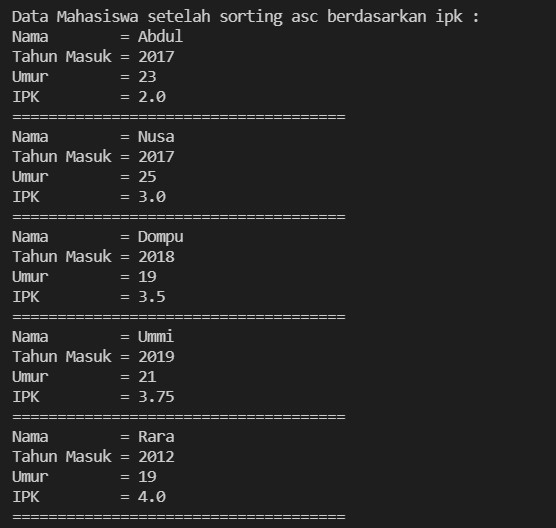

**5.3.3 Pertanyaan** 

Di dalam method selection sort, terdapat baris program seperti di bawah ini: 

```
            int idxMin = i;
            for(int j=i+1; j<listMhs.length; j++){
                if(listMhs[j].ipk < listMhs[idxMin].ipk){
                    idxMin = j;
                }
            }
```

Untuk apakah proses tersebut, jelaskan! 

**Jawab:** 
Proses di atas ialah proses pengurutan secara Ascending (Kecil ke Besar). Adapun alur prosesnya sebagai berikut:
    - yang dilakukan pertama ialah menginisialisasi variabel **idxMin** nilainya sama dengan nilai i, yang nantinya menjadi tempat untuk menampung nilai perbandingan pada perulangan di atas.
    - Lalu, perbandingan dilakukan yaitu ``for(int j=i+1; j<listMhs.length; j++)`` yang mana artinya perulangan tetap dilakukan selama nilai dari j kurang dari panjang array listMhs. Pada case ini akan dilakukan sebanyak 4 kali, karena nilai j dimulai dari 0+1 = 1 dan jumlah elemen array yaitu 5 index.
    - Setelah itu, dilakukan perbandigan yang mana jika nilai ipk dari index ke-j < nilai ipk dari index idxMin, maka akan dilakukan swap.pertukaran dari kecil ke besar.

**5.4 Mengurutkan Data Mahasiswa Berdasarkan IPK Menggunakan Insertion Sort** 

**5.4.2 Verifikasi Hasil Percobaan** 

Pastikan output yang ditampilkan sudah benar seperti di bawah ini
 


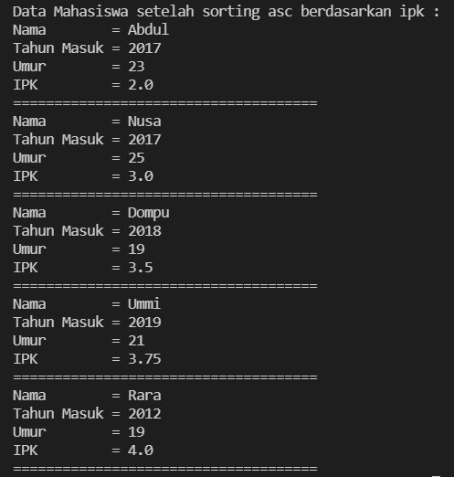


**5.4.3 Pertanyaan** 

Ubahlah fungsi pada InsertionSort sehingga fungsi ini dapat melaksanakan proses sorting dengan cara ascending atau decending, anda dapat melakukannya dengan menambahkan parameter pada pemanggilan fungsi insertionSort. 

**Jawab:**
- Code 
    - Method insertionSort()
        ```
        void insertionSort(boolean asc){ 
            for(int i=1; i<listMhs.length; i++){
                Mahasiswa temp = listMhs[i];
                int j=i;
                if(asc){
                    for( ; j>0 && listMhs[j-1].ipk > temp.ipk; j--){
                        listMhs[j] = listMhs[j-1];
                    }
                }else{
                    for( ; j>0 && listMhs[j-1].ipk < temp.ipk; j--){
                        listMhs[j] = listMhs[j-1];
                    }
                }
                listMhs[j] = temp;
            }
        }
        ```

    - Method Main()
        ```
        System.out.println("Data Mahasiswa setelah sorting asc berdasarkan ipk : ");
        list.insertionSort(true);
        list.tampil();
        System.out.println("Data Mahasiswa setelah sorting dsc berdasarkan ipk : ");
        list.insertionSort(false);
        list.tampil();
        ```

- Output
    - Ascending:

        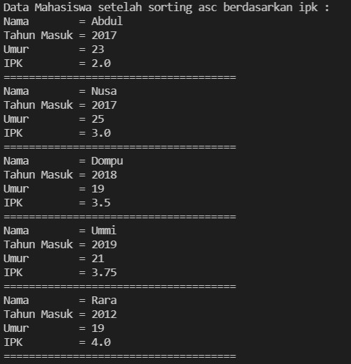

    - Descending:

        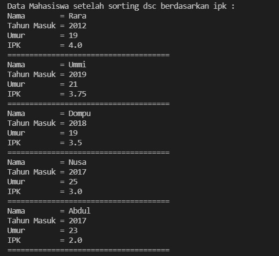 

**5.5 Latihan Praktikum** 

Sebuah  yang  bergerak  dalam  bidang  penjualan  tiket  pesawat  sedang  mengembangkan backend untuk sistem pemesanan tiket, salah satu fiturnya adalah menampilkan daftar tiket yang tersedia berdasarkan pilihan filter yang diinginkan user. Daftar tiket ini harus dapat di sorting  berdasarkan  harga  dimulai  dari  harga  termurah  ke  harga  tertinggi. Implementasikanlah class diagram berikut ini kedalam bahasa pemrograman java kemudian buatlah  proses  sorting  data  untuk  harga  tiket  menggunakan  algoritma  **bubble  sort**  dan **selection sort**.  

**Jawab:**

- Code:

```
public class Tiket {
    String maskapai, asal, tujuan;
    int harga;
    
    Tiket(String m, int h, String a, String t){
        maskapai = m;
        harga = h;
        asal = a;
        tujuan = t;
    }
    
    void tampilAll(){
        System.out.println("                     MERDEKA AIRPORT                     ");
        System.out.println("----------------------------------------------------------");
        System.out.println("NAMA MASKAPAI   : "+maskapai);
        System.out.println("ASAL            : "+asal);
        System.out.println("TUJUAN          : "+tujuan);
        System.out.println("HARGA           : "+harga);
    }
}
public class TiketService {
        Tiket tikets[] = new Tiket[5];
        int tik;
    
        void tambah(Tiket msk){
           if(tik < tikets.length){
               tikets[tik] = msk;
               tik++;
           }
        }
    
        void tampilAll(){
            for(Tiket msk : tikets){
                msk.tampilAll();
            }
        }
    
        void bubbleSort(){
            for(int i=0; i<tikets.length; i++){
                for(int j=1; j<tikets.length; j++){
                    if(tikets[j].harga > tikets[j-1].harga){
                        //swap
                        Tiket swp = tikets[j];
                        tikets[j] = tikets[j-1];
                        tikets[j-1] = swp;
                    }
                }
            }
        }
    
        void selectionSort(){
            for(int i=0; i<tikets.length; i++){
                int idxMin = i;
                for(int j=i+1; j<tikets.length; j++){
                    if(tikets[j].harga < tikets[idxMin].harga){
                        idxMin = j;
                    }
    
                    Tiket swap = tikets[idxMin];
                    tikets[idxMin] = tikets[i];
                    tikets[i] = swap;
                }
            }
        }
    }
import java.util.Scanner;
public class TiketMain {
        public static void main(String args[]){
            Scanner sc = new Scanner(System.in);
            TiketService Prak = new TiketService();
    
            Tiket tkt1 = new Tiket("Lion Air", 500000, "Surabaya", "Semarang");
            Tiket tkt2 = new Tiket("Garuda Indonesia", 350000, "Surabaya", "Malang");
            Tiket tkt3 = new Tiket("Garuda Indonesia", 450000, "Pekanbaru", "Surabaya");
            Tiket tkt4 = new Tiket("indonesia AirAsia", 360000, "Malang", "Jakarta");
            Tiket tkt5 = new Tiket("Batik Air", 570000, "Surabaya", "Yogyakarta");
    
            Prak.tambah(tkt1);
            Prak.tambah(tkt2);
            Prak.tambah(tkt3);
            Prak.tambah(tkt4);
            Prak.tambah(tkt5);

            char ulang = 'Y';
            do{
                System.out.println("");
                System.out.println(" DATA SEBELUM SORTING ");
                System.out.println("==========================================================");
                Prak.tampilAll();
                System.out.println("");
                System.out.println("Pilihan Sorting: ");
                System.out.println("1. Ascending ");
                System.out.println("2. Descending ");
                System.out.println("");
                System.out.print("Masukkan Pilihan: ");
                int pil = sc.nextInt();
                
                switch(pil){
                    case 1:
                    System.out.println("");
                    System.out.println("Pengurutan Besar ke Kecil (Ascending)");
                    System.out.println("");
                    System.out.println("Daftar Data Maskapai setelah sorting berdasarkan harga");
                    System.out.println("=========================================================");
                    Prak.bubbleSort();
                    Prak.tampilAll();
                    break;
                    case 2:
                    System.out.println("");
                    System.out.println("Pengurutan Kecil ke Besar (Descending)");
                    System.out.println("");
                    System.out.println("Daftar Data Maskapai setelah sorting berdasarkan harga");
                    System.out.println("==========================================================");
                    Prak.selectionSort();
                    Prak.tampilAll();
                    break;
                    
                    default:
                    System.out.println("Pilihan yang Anda masukkan salah!");
                }
                System.out.print("Apakah ingin sorting lagi? (Y/T) :");
                ulang = sc.next().charAt(0);
            }while(ulang == 'Y' || ulang == 'y');
            System.out.println("");
            System.out.println("TERIMA KASIH ");
        }
    }
```

- Output:
    - Sebelum Sorting:

        


    - Setelah Sorting (Ascending):

        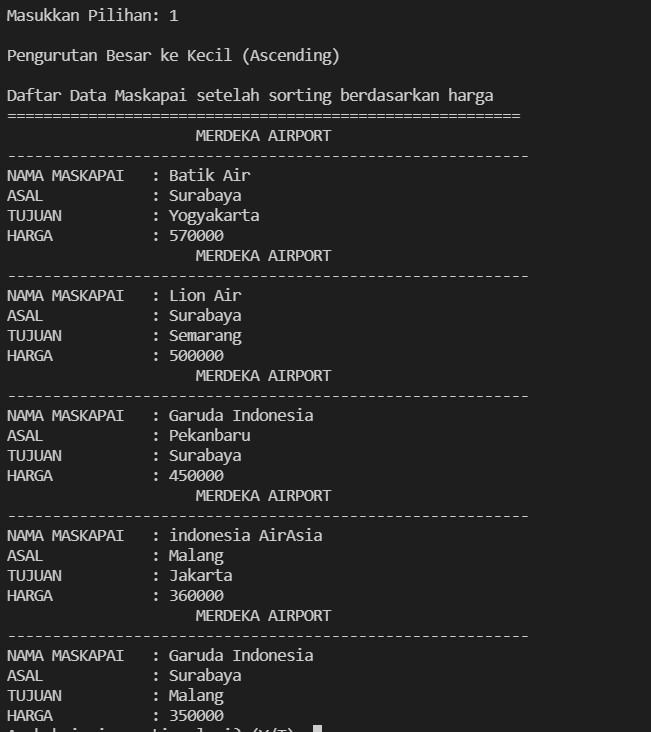

    - Setelah Sorting (Descending):

        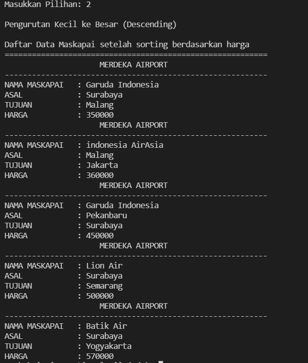

